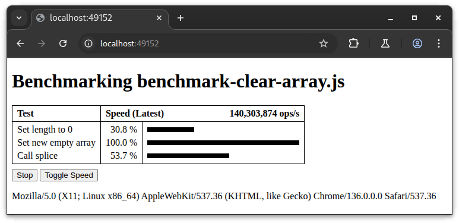

# Benchmark

[GitHub] | [NPM] | [API Doc]

Simple benchmarking tool for command-line (Node.js) and Web.

## Installation

Install the benchmark library as a development dependency:

```sh
npm install -D @kayahr/benchmark
```

## Writing a benchmark test

This is an example to benchmark the speed of `Math.max` compared to a manual conditional expression:

```js
import { benchmark } from "@kayahr/benchmark";

await benchmark([
    { name: "Math.max", operation: (a, b) => Math.max(a, b) },
    { name: "Conditional", operation: (a, b) => (a > b) ? a : b }
]);
```

The `benchmark` function takes an array of test definitions. Each test definition has a `name` property for displaying in the benchmark result, and an
`operation` property defining a closure function containing the code to benchmark.

The operation function receives two numeric arguments which can be used as entropy to generate dynamic results which can be returned by the function to prevent the JS engine from discarding dead code or optimizing static code. The first argument is the current iteration index, starting with 0 and incremented on each iteration within the current test cycle. The second argument is the total number of iterations done in the current test cycle.

For the operation function the meaning of these two parameters usually do not matter. They are used as entropy because they already exist and doesn't consume time to calculate. Just keep in mind that the first value starts with 0 and is incremented by one on each iteration and the second one is always greater than 0 and stays the same within the current test cycle. Here are some examples how these two arguments could be used:

* If you benchmark some math expression, you can use one or both of the values in it: `(a, b) => Math.max(a, b)` or `a => Math.pow(a, 2)`. But don't use the arguments in places where large values can make trouble. Using one of the arguments as exponent for `Math.pow` would be a bad idea and would most likely end up with `Infinity` as a result. Instead you could use the first argument to toggle between two exponents: `a => Math.pow(1234, a & 1 ? 10 : 20)`
* If you benchmark some array operation, you can fill the array with values based on the first argument: `a => new Array(1000).fill(a)`. But don't use any of the two parameters as array size because depending on the benchmark speed the numbers can get very high.
* If you benchmark some string operations, you can use one or both arguments to create dynamic strings: `a => ("Test-String-" + a).toLowerCase()`

Test data which is shared in all test runs can be created before the benchmark call and can be initialized/reset before each test cycle with an init callback like this:

```js
let array: number[];

// Benchmark array clearing
await benchmark([
    {
        name: "Set length to 0",
        operation: () => array.length = 0
    },
    {
        name: "Set new empty array",
        operation: () => array = []
    },
    {
        name: "Call splice",
        operation: () => array.splice(0)
    }
], {
    init: () => {
        array = [ 1, 2, 3, 4 ];
    }
});
```

## Running in Node.js

To run the benchmark in Node.js, simply execute the JavaScript file with `node`. It constantly measures the speed of all tests and updates the output every 250 milliseconds:

```text
$ node benchmark-clear-array.js
╔═════════════════════╤════════════════════════════════════════════════════════╗
║ Test                │ Speed (Latest)                       137,257,007 ops/s ║
╟─────────────────────┼─────────┬──────────────────────────────────────────────╢
║ Set length to 0     │  22.4 % │ ■■■■■■■■■■                                   ║
║ Set new empty array │ 100.0 % │ ■■■■■■■■■■■■■■■■■■■■■■■■■■■■■■■■■■■■■■■■■■■■ ║
║ Call splice         │  55.4 % │ ■■■■■■■■■■■■■■■■■■■■■■■■                     ║
╚═════════════════════╧═════════╧══════════════════════════════════════════════╝
Benchmarking... (Press CTRL-C or Q to quit, M to toggle speed display mode)
```

With the hotkey `M` you can switch between latest and average speed. With `Q` or `Ctrl-C` you can exit the benchmark.

If the console is not interactive (for example when redirecting output into a file) then the benchmark is run 25 times (approximately 7 seconds) and the average result is printed once:

```text
$ node benchmark-clear-array.js > result.txt
$ cat result.txt
╔═════════════════════╤════════════════════════════════════════════════════════╗
║ Test                │ Speed (Average)                      123,635,798 ops/s ║
╟─────────────────────┼─────────┬──────────────────────────────────────────────╢
║ Set length to 0     │  24.8 % │ ■■■■■■■■■■■                                  ║
║ Set new empty array │ 100.0 % │ ■■■■■■■■■■■■■■■■■■■■■■■■■■■■■■■■■■■■■■■■■■■■ ║
║ Call splice         │  58.4 % │ ■■■■■■■■■■■■■■■■■■■■■■■■■■                   ║
╚═════════════════════╧═════════╧══════════════════════════════════════════════╝
```


## Running in browser

The easiest way is to run the benchmark script with node and the `--web` command line option:

```text
$ node benchmark-clear-array.js --web
Benchmark served on http://localhost:49152/
Press Ctrl-C to exit
```

And then simply open the given URL in the browser of your choice:



This solution is based on [esbuild] to bundle the benchmark script and all its dependencies into a single JavaScript file and starting a simple Node.js HTTP server to serve this JavaScript file together with a minimum HTML index file.

An alternative way is using a local webserver which can serve your projects via HTTP (like Apache with a `public_html` directory) and writing an HTML file which defines an [ESM import map] to load dependencies like `@kayahr/benchmark` and other dependencies needed by your benchmark tests and then load the benchmark test script as an ES module at the place where your want the output to appear:

```html
<!DOCTYPE html>
<html>
  <head>
    <meta charset="UTF-8" />
    <title>Clear Array Benchmark</title>
    <script type="importmap">
      {
        "imports": {
          "@kayahr/benchmark": "./node_modules/@kayahr/benchmark/lib/main/index.js"
        }
      }
    </script>
  </head>
  <body>
    <script type="module" src="benchmark-clear-array.js"></script>
  </body>
</html>
```

[API Doc]: https://kayahr.github.io/benchmark/
[GitHub]: https://github.com/kayahr/benchmark
[NPM]: https://www.npmjs.com/package/@kayahr/benchmark
[ESM import map]: https://developer.mozilla.org/en-US/docs/Web/HTML/Reference/Elements/script/type/importmap
[esbuild]: https://esbuild.github.io/
